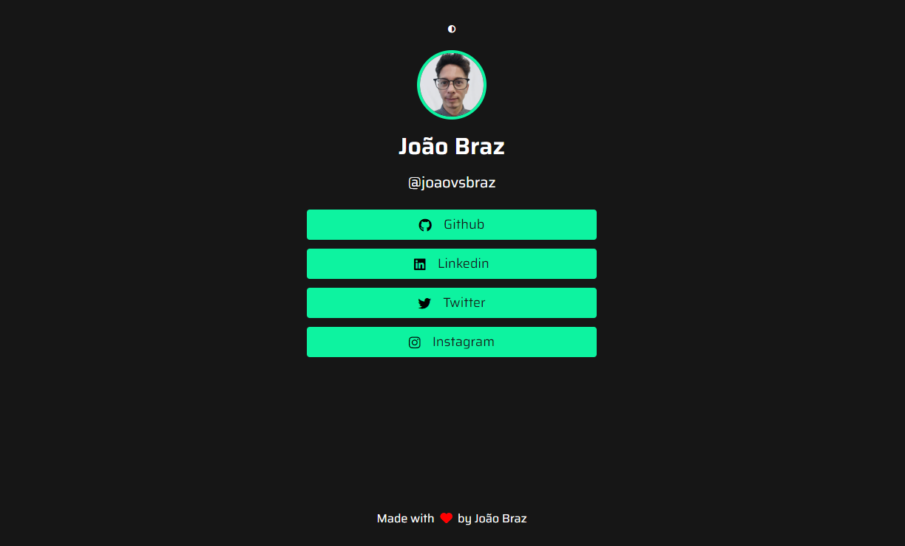

# My Links



[My links](https://joaovsbraz.github.io/my-links/) is a simple page that groups social links for social medias. Inspired by Rocketseat Rocket Links project.

## Table of contents

- [Overview](#overview)
- [My process](#my-process)
  - [Built with](#built-with)
  - [What I learned](#what-i-learned)
  - [Links](#links)
  - [References](#references)

## Overview

My links is a simple page that do social linking similarly to linktree.

## My process

### Built with

- Semantic HTML5
- CSS
- Flexbox
- Responsive design with media queries
- Javascript
- Fontawesome Icons

### What I learned

In this project I've implemented the light theme (dark is the default) changing elements background color and text color using Javascript.

```javascript
if (lightTheme.classList.contains('active')) {
    lightTheme.style.color = '#161616';
    toWhiteBackground(whiteBackground);
    toDarkText(darkText);
  } else {
    lightTheme.style.color = '#F9F9F9';
    toDarkBackground(darkBackground);
    toWhiteText(whiteText);
  }
```

### Links

You can check the project online [here](https://joaovsbraz.github.io/my-links/)!

### References

- [Font Awesome](https://fontawesome.com/)
- [Google Fonts](https://fonts.google.com/)
- [Linktree](https://linktr.ee/)
- [My Links](https://joaovsbraz.github.io/my-links/)